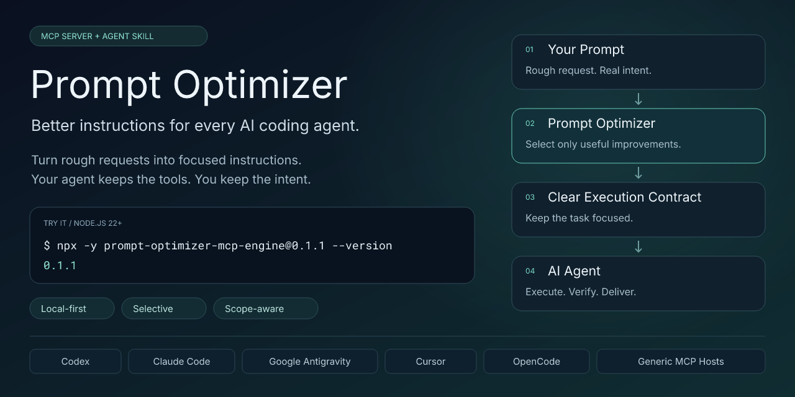
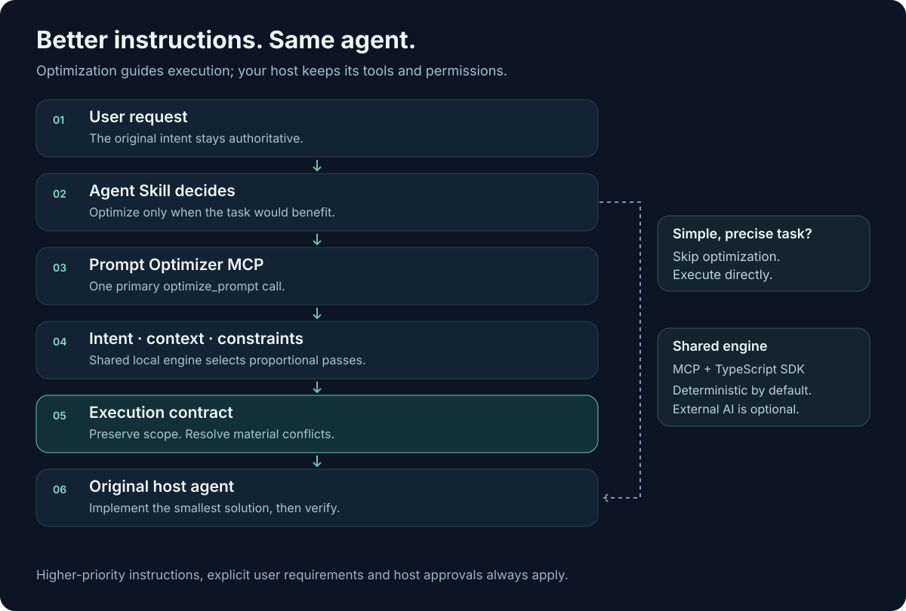

<p align="center">
  
</p>

<h1 align="center">Prompt Optimizer</h1>

<p align="center"><strong>Give every AI coding agent better instructions before it starts working.</strong></p>

<p align="center">
  <a href="https://www.npmjs.com/package/prompt-optimizer-mcp-engine"></a>
  <a href="LICENSE"></a>
  <a href="package.json"></a>
  <a href="docs/verification.md"></a>
  <a href="docs/api.md"></a>
</p>

Install an **MCP server + portable Agent Skill**. Your existing agent gains the ability to turn vague, complex or context-heavy requests into focused instructions, then execute them. No API key required.

[Quick start](#quick-start) · [Install guides](#install-guides) · [Examples](examples/before-after.md) · [API](docs/api.md) · [Troubleshooting](docs/troubleshooting.md)

## Why Prompt Optimizer?

Small gaps in a request can become large implementation assumptions. Prompt Optimizer helps the agent clarify relevant requirements, preserve constraints and verify its work without turning every task into a lengthy specification.

- **Local-first and deterministic:** useful optimization without network access or an external model.
- **Selective and proportional:** complex tasks get structure; trivial requests stay out of the optimizer.
- **Repository-aware and scope-aware:** reuse project conventions, avoid unnecessary abstractions and preserve the requested features.
- **Portable and inspectable:** MCP, an instruction-only Agent Skill and a TypeScript SDK share one engine. Context ranking, compression and pass explanations are built in.

## How it works

**Prompt Optimizer improves instructions. Your AI agent executes the work.**

The skill decides whether optimization would help, reads only necessary repository context, calls `optimize_prompt`, then uses the validated result as an **execution contract**. The host implements and verifies that contract while respecting higher-priority instructions and explicit user requirements.

## Supported AI agents

| Host               | MCP | Agent Skill          | Evidence                                            |
| ------------------ | --- | -------------------- | --------------------------------------------------- |
| OpenAI Codex       | Yes | Yes                  | Integration supported; MCP protocol tested          |
| Claude Code        | Yes | Yes                  | Integration supported; MCP protocol tested          |
| Google Antigravity | Yes | Yes                  | CLI live tested, user-reported v0.1.x; IDE untested |
| Cursor             | Yes | Yes                  | Integration supported; MCP protocol tested          |
| OpenCode           | Yes | Yes                  | Integration supported; MCP protocol tested          |
| Generic MCP hosts  | Yes | If supported by host | Protocol tested; portable skill available           |

Protocol tests use the official MCP client; they do not substitute for live testing each host. Agent names identify integrations and imply no endorsement. See the [compatibility matrix and evidence](docs/compatibility.md).

## Quick start

With **Node.js 22+**, check the package and local server health:

```sh
npx -y prompt-optimizer-mcp-engine@0.1.1 --version
npx -y prompt-optimizer-mcp-engine@0.1.1 doctor
```

### Install MCP

Codex:

```sh
codex mcp add prompt-optimizer -- npx -y prompt-optimizer-mcp-engine@0.1.1
```

Claude Code, project scope:

```sh
claude mcp add --transport stdio --scope project prompt-optimizer -- npx -y prompt-optimizer-mcp-engine@0.1.1
```

For Antigravity, Cursor, OpenCode and other clients, use the [host guides](#install-guides). Stdio and Streamable HTTP are supported.

### Install Agent Skill

The skill teaches the host **when** and **how** to optimize. Install the package globally to access its portable installer; from your target project, in a POSIX shell:

```sh
npm install --global prompt-optimizer-mcp-engine@0.1.1
PROMPTOPT_ROOT="$(npm root -g)/prompt-optimizer-mcp-engine"
node "$PROMPTOPT_ROOT/scripts/install-skill.mjs" --agent codex --scope project --project "$PWD"
```

Replace `codex` with `claude-code`, `antigravity`, `cursor`, `opencode` or `generic` as appropriate. Antigravity CLI global installs use `--agent antigravity-cli --scope user`. The installer refuses to overwrite an existing skill: review and refresh a previous copy when upgrading. **Updating npm alone does not update a copied skill.**

Restart the host. For a quick discovery test, ask: **“Use Prompt Optimizer's inspect_prompt tool to analyze ‘fix auth’ without executing it.”** For explicit optimization: **“Use the prompt-optimizer skill to optimize this task, then execute it: …”**

### Install guides

[Codex](docs/install/codex.md) · [Claude Code](docs/install/claude-code.md) · [Google Antigravity](docs/install/antigravity.md) · [Cursor](docs/install/cursor.md) · [OpenCode](docs/install/opencode.md) · [Generic MCP / VS Code / Gemini](docs/install/generic-mcp.md) · [Local build](docs/install/local-build.md) · [Portable Agent Skill](docs/install/generic-skill.md)

## Example: request → contract → execution

**Before**, from the Antigravity CLI field test:

```text
Buat dashboard admin untuk platform AI yang menampilkan penggunaan token,
status model, biaya, dan riwayat request.
Gunakan Next.js dan sesuaikan dengan project yang sudah ada.
```

In the user's v0.1.1 fresh-session replay, the skill recognized this multi-feature, repository-aware task and invoked `optimize_prompt` before implementation.

**Optimized guidance**, abbreviated and representative rather than a verbatim trace:

> Build the requested Next.js admin dashboard within the existing project. Cover token usage, model status, costs and request history. Reuse existing components and conventions. Keep changes focused; include responsive behavior, accessibility and relevant interaction states. Run the appropriate checks and report the result.

**Execution:** the same host agent implements that scope. It should not invent a prompt studio, model registry, webhook system or other major features. Necessary repository-specific details may be added to carry out the task.

## Selective optimization

| Request                                             | Expected skill decision                |
| --------------------------------------------------- | -------------------------------------- |
| “Buat dashboard AI modern pakai Next.js.”           | Optimize before implementation         |
| “Fix authentication ini dan rapikan arsitekturnya.” | Optimize and surface scope/constraints |
| “Ubah warna tombol utama jadi merah.”               | Skip; make the direct edit             |
| “Apa arti dependency?” / “jalankan npm run build”   | Skip; answer or execute directly       |
| “Optimize this prompt…”                             | Optimize explicitly                    |

A successful result stays the execution contract, not a starting point for a broader specification. Normally use **one primary optimization pass**; do not recursively optimize its output or run all nine tools on every task. Automatic discovery remains host-controlled. [Activation troubleshooting](docs/troubleshooting.md#mcp-visible-but-optimizer-does-not-auto-trigger).

## Tools

| MCP tool                       | Purpose                                                       |
| ------------------------------ | ------------------------------------------------------------- |
| `optimize_prompt`              | Improve a request with proportional execution guidance        |
| `inspect_prompt`               | Analyze intent, gaps, conflicts and context without rewriting |
| `adapt_prompt`                 | Apply documented target-agent conventions                     |
| `evaluate_prompt`              | Return clearly labeled heuristic quality diagnostics          |
| `compare_prompts`              | Compare strengths and weaknesses by dimension                 |
| `compress_context`             | Rank, deduplicate and budget relevant context                 |
| `build_agent_instruction`      | Assemble explicit task information into instructions          |
| `explain_optimization`         | Explain supplied optimization records                         |
| `suggest_optimization_profile` | Recommend a proportional local profile                        |

Also available: five read-only resources and five optional task templates. [Full API](docs/api.md).

## Architecture



The independent TypeScript core powers the MCP server and SDK. The portable skill contains workflow guidance, not a duplicate optimization engine. Tools work without skills; skills offer a lightweight fallback without MCP.

```ts
import { PromptOptimizer } from 'prompt-optimizer-mcp-engine';

const result = await new PromptOptimizer().optimize({
  prompt: 'buat dashboard ai keren pake nextjs',
  targetAgent: 'codex',
  profile: 'balanced',
  mode: 'local',
});
console.log(result.optimizedPrompt);
```

[Architecture](docs/architecture.md) · [Optional OpenAI-compatible, Anthropic and Gemini providers](docs/providers.md)

## Security and privacy

Local mode makes no remote model requests and needs no API key. No telemetry is collected. Remote AI requires explicit configuration and mode selection. Context is untrusted data; optimizer advice cannot override higher-priority instructions or host approvals.

Secret redaction is defense-in-depth, not a guarantee. Classification, conflict checks, token estimates and quality diagnostics are heuristic. They do not prove semantic fidelity or safe execution. [Security model](docs/security.md) · [Report a vulnerability](SECURITY.md)

## Development

```sh
pnpm install --frozen-lockfile
pnpm build
pnpm check
pnpm examples
pnpm run doctor
```

[Verification](docs/verification.md) · [Release process](docs/releasing.md) · [Reference projects and licenses](docs/references.md)

## Roadmap

Broaden live host coverage, benchmark multilingual intent preservation and improve context provenance. New capabilities must preserve selective activation and bounded scope.

## Contributing

Bug reports, reproducible host traces and focused contributions are welcome. See [CONTRIBUTING.md](CONTRIBUTING.md) and the [code of conduct](CODE_OF_CONDUCT.md).

## License

[MIT](LICENSE). Built for the open agent ecosystem.
