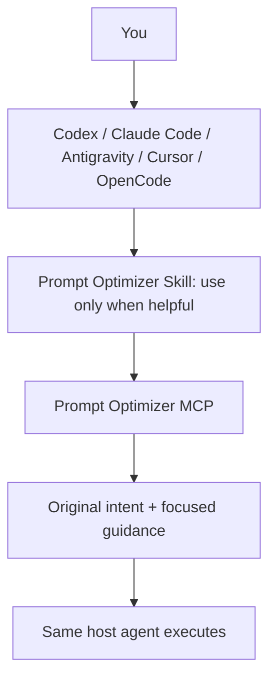

# Prompt Optimizer

**Give every AI agent better instructions.**

Prompt Optimizer adds an instruction-optimization layer to AI agents. Install it as an **MCP server + Agent Skill**. Your existing agent can turn a rough request into clearer, context-aware execution guidance, then do the work itself.

Local-first. No API key required. No telemetry. Selective optimization, bounded additions, inspectable decisions. **v0.1.0.** See [GitHub releases](https://github.com/terngg/prompt-optimizer/releases) and the [npm registry](https://www.npmjs.com/package/prompt-optimizer-mcp-engine) for publication status.



## Try it locally

Node.js 22+ and pnpm 10.32.1:

```sh
pnpm install --frozen-lockfile
pnpm build
pnpm run doctor
pnpm smoke
```

Add the MCP server to your host. For Codex, from this checkout:

```sh
codex mcp add prompt-optimizer -- node /root/prompt/dist/apps/mcp-server/src/cli.js
node scripts/install-skill.mjs --agent codex --scope project --project /root/prompt
```

Use your checkout and target project paths. `node scripts/config.mjs codex` emits a configuration with the correct absolute paths for your machine. The skill installer never overwrites an existing skill.

Then ask your agent: **“Use prompt-optimizer to improve this instruction, then execute it: fix auth.”** Automatic skill selection also works where the host supports it; trivial questions and precise instructions should pass through unchanged.

[Codex](docs/install/codex.md) · [Claude Code](docs/install/claude-code.md) · [Antigravity IDE/CLI](docs/install/antigravity.md) · [Cursor](docs/install/cursor.md) · [OpenCode](docs/install/opencode.md) · [Generic MCP / VS Code / Gemini](docs/install/generic-mcp.md) · [Generic Skill](docs/install/generic-skill.md)

## What changes?

`fix auth` receives targeted guidance to inspect and reproduce the failure, make a small fix, add an appropriate regression check, and verify. It does not become a rewrite.

`buat dashboard ai keren pake nextjs` retains the Indonesian request and gains relevant repository, responsive UI, accessibility, interaction-state and verification guidance. It does not acquire invented product features.

`cari database terbaik buat saas gw` selects research criteria and source requirements, without instructing the agent to implement a database.

`rapihin project ini dan fix semuanya` surfaces broad scope and recommends bounded work. `What is 2 + 2?` remains unchanged.

See [actual generated before/after examples](examples/before-after.md). Every result can explain applied/skipped passes, assumptions, redaction, conflicts, and estimated token impact.

## Capabilities

| MCP tool                       | Purpose                                                       |
| ------------------------------ | ------------------------------------------------------------- |
| `optimize_prompt`              | Preserve the task and add proportional execution guidance     |
| `inspect_prompt`               | Analyze intent, gaps, conflicts and context without rewriting |
| `adapt_prompt`                 | Add documented host conventions                               |
| `evaluate_prompt`              | Transparent heuristic diagnostics                             |
| `compare_prompts`              | Dimensional comparison without an arbitrary winner            |
| `compress_context`             | Rank, deduplicate, extract relevant lines and budget context  |
| `build_agent_instruction`      | Assemble explicit task information                            |
| `explain_optimization`         | Explain caller-supplied pass records, without server history  |
| `suggest_optimization_profile` | Choose a proportional local profile                           |

Read-only resources: `promptopt://profiles`, `passes`, `skills`, `compatibility`, `version` (each uses the same URI prefix). Optional templates: `optimize-coding-task`, `optimize-debugging-task`, `optimize-research-task`, `optimize-ui-task`, `optimize-agent-task`.

Stdio and Streamable HTTP share the same engine. A portable instruction-only skill teaches activation, tool choice, priority, recursion protection and fallback. The skill is useful even without MCP; MCP tools remain useful without skills.

## SDK and optional AI

```ts
import { PromptOptimizer } from 'prompt-optimizer-mcp-engine';

const optimizer = new PromptOptimizer();
const result = await optimizer.optimize({
  prompt: 'buat dashboard ai keren pake nextjs',
  targetAgent: 'codex',
  profile: 'balanced',
  mode: 'local',
});
console.log(result.optimizedPrompt);
```

Use the package import after [installing the local tarball](docs/install/local-build.md) or after publication. In this checkout use `dist/packages/sdk/src/index.js`; run `pnpm examples` for working examples.

Profiles (`minimal`, `balanced`, `thorough`) control additions. Modes (`local`, `fast`, `balanced`, `high`, `max`) control optional model calls. Remote modes require trusted server configuration **and** explicit selection. OpenAI-compatible, Anthropic and Gemini adapters support an optional separate evaluator. [Provider setup and privacy](docs/providers.md).

MCP sampling is deprecated in the current protocol, so this release uses optional provider APIs and deterministic fallback. [Compatibility and official sources](docs/compatibility.md).

## Trust and limits

The original task stays authoritative. Added advice cannot override explicit user or higher-priority instructions. Context stays untrusted data. Critical context survives compression; impossible budgets produce diagnostics instead of silent truncation. Repeated optimization is guarded by host task state and result hashes.

Classification, conflict detection, scores and token estimates are heuristic, with English/Indonesian coverage. They do not prove semantic fidelity or better execution. Secret redaction is best-effort. Live vendor hosts and paid provider models have not been tested; protocol clients and local provider fixtures have. See [security](docs/security.md) and [compatibility](docs/compatibility.md).

## Develop and release

```sh
pnpm check
pnpm examples
pnpm pack
```

[Architecture](docs/architecture.md) · [Tool API](docs/api.md) · [Verification](docs/verification.md) · [Troubleshooting](docs/troubleshooting.md) · [References/licenses](docs/references.md) · [Release instructions](docs/releasing.md) · [Contributing](CONTRIBUTING.md)

MIT licensed. Maintained at [terngg/prompt-optimizer](https://github.com/terngg/prompt-optimizer). See [release instructions](docs/releasing.md) for verification and publication.
