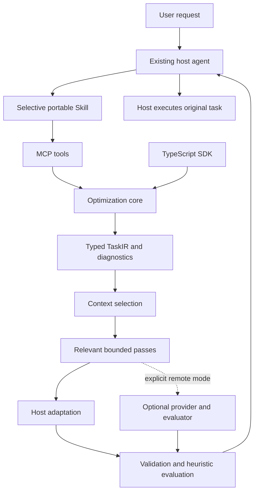

# Architecture

Prompt Optimizer enhances the host's instructions. It never executes the user's task, launches arbitrary commands, edits a repository, or installs a provider on the user's behalf.

## Package boundaries

The repository uses modules under `packages/` and one distributable npm package. This avoids a chain of separately published packages for a small v0.1 release. Relative ESM imports and generated declarations keep the modules reusable. Core imports no MCP code.

| Module            | Responsibility                                                      |
| ----------------- | ------------------------------------------------------------------- |
| `shared`          | Zod schemas, typed TaskIR, limits, redaction, estimates             |
| `core`            | Classification, analysis, pass selection, orchestration, validation |
| `passes`          | Domain guidance registry and conservative prose deduplication       |
| `context`         | Exact deduplication, term ranking, whole-line extraction, budgets   |
| `evaluators`      | Explicitly heuristic diagnostics and dimensional comparisons        |
| `adapters`        | Documented host conventions; no secret model phrases                |
| `providers`       | Optional bounded HTTP adapters and provider interfaces              |
| `sdk`             | Public exports                                                      |
| `apps/mcp-server` | Tool/resource/prompt registration, transport, debug CLI             |

## Task representation and authority

TaskIR stores source, goal, intents, requirements, constraints, assumptions, context, optional output contract, diagnostics and metadata. `serializeTask` / `deserializeTask` validate this representation. Empty tools/skills/acceptance arrays mean no evidence was extracted; they are not fabricated requirements.

Original explicit statements retain user provenance. Added instructions have optimizer provenance in pass reports and a visible lower-priority heading. Context does not accept an authority field. Its `critical` bit controls retention only. Project/system/developer priority names are descriptive: accepting a prompt does not give it that authority in the host.

English and common Indonesian task signals are supported. Confidence is rule evidence, not a calibrated probability. Other languages preserve their source but may receive little useful classification; guidance is English unless Indonesian cues are recognized.

## Selectivity and token budgets

Profiles control additions, independently from AI modes:

| Profile  | Domain pass limit | Added estimated tokens |
| -------- | ----------------: | ---------------------: |
| minimal  |                 2 |                    160 |
| balanced |                 7 |                    360 |
| thorough |                10 |                    600 |

Adapter/audience guidance also consumes the addition budget. Each registry pass declares domains, reason, confidence, benefit, instruction, covered-cue and blocking-cue checks. Domain filtering comes first, followed by explicit restriction checks, coverage, pass count and token cost. Research and review do not become coding permission.

Exact adjacent repeated standalone prose instructions can be removed conservatively. Code, quotations, examples and creative repetition are excluded. The original remains in TaskIR. Total token budgets are best-effort: explicit source cannot be blindly truncated. Critical context can exceed its separate budget, and embedded context may be omitted from the instruction when it does not fit. Both cases produce diagnostics and preserve the structured context result.

Tokens use `ceil(UTF-8 bytes / 4)`, not a model tokenizer. Estimates can differ materially from actual token usage, especially for non-Latin text. Full MCP structured responses include audit data and are larger than `optimizedPrompt`; the prompt budget does not cap the whole protocol response. Use `explain: false` to reduce pass detail.

## AI assistance

The original remains authoritative. AI generates short recommendations, never a replacement goal. All modes start with local analysis and bounded context. Candidates must pass JSON validation, redaction, conservative conflict/injection checks, deduplication and token limits. These cannot prove semantic intent preservation; host review is required. Providers have no tools.

`fast` and `balanced` both make at most one call in v0.1 and share deterministic validation. `high` adds critique and revision (up to three calls). `max` uses two candidates, critique, synthesis and final review (up to five calls). A separately configured evaluator is supported; otherwise critique uses the generator provider and is not independent evidence. Rejected candidates, errors, missing credentials and timeouts fall back to deterministic guidance. No hidden retries.

MCP sampling is intentionally absent: the current specification deprecates it and discourages new adoption. [Current sampling lifecycle](https://modelcontextprotocol.io/specification/2026-07-28/client/sampling).

## Transport and lifecycle

Official SDK v2 `serveStdio` and `createMcpHandler` share a server factory. The HTTP wrapper is Node's built-in server plus the official `toNodeHandler`. Modern discovery and legacy initialization are tested separately. Legacy HTTP is stateless; it does not retain sessions or replay events. No legacy HTTP+SSE endpoint is implemented.

Recursion state belongs to the host task. Pass `metadata.version` and `metadata.outputHash` as `previousOptimization` for an identical repeat. This is idempotence metadata, not a cryptographic authenticity claim. The server stores no prompts, task history, memory, credentials, or telemetry. Caller-provided memory entries are ordinary context.

## Deliberate limits

Local methods are lexical, not semantic reasoning. Conflict detection covers explicit common patterns, not every logical contradiction. There is no vector database, trained prompt optimizer, arbitrary plugin execution, repo crawler, or runtime TypeScript config loader. Configuration is SDK options or named environment variables. Long-running remote service deployment, OAuth, semantic compression, sampling migration alternatives, and live host/model quality benchmarks remain future work.
